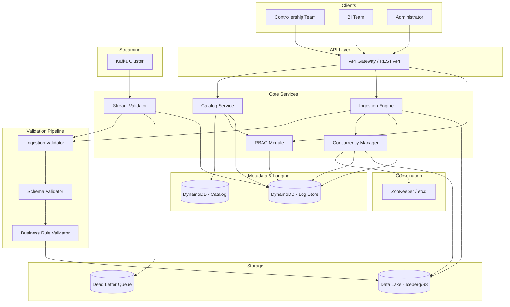

# Design Document: Andes Data Lake

## Overview

Andes Data Lake is a centralized, ACID-compliant data lake for accounting datasets. It serves two primary user groups: the Controllership Team (publishers) and the BI Team (consumers). The system supports batch ingestion and live-streamed data from stock markets, with multi-layer validation, distributed concurrency handling, and centralized logging backed by DynamoDB.

The architecture follows a modular, event-driven design with clear separation between ingestion, validation, storage, catalog, access control, and observability layers. Each component communicates through well-defined interfaces, enabling independent scaling and deployment.

### Key Design Decisions

- **Apache Iceberg on S3** for the storage layer — provides ACID transactions, schema evolution, versioning, and time-travel queries on top of object storage.
- **Apache Kafka** for live stream ingestion — provides durable, ordered, replayable event streams with consumer group offset management.
- **DynamoDB** for the Log Store and Catalog metadata — provides single-digit millisecond latency, horizontal scalability, and strong consistency for operational logs and metadata.
- **Optimistic Concurrency Control (OCC)** for conflict resolution — uses version tokens to detect and resolve write conflicts without pessimistic locking overhead.
- **Apache ZooKeeper / etcd** for distributed coordination — provides distributed locks, leader election, and lease management for the Concurrency Manager.

## Architecture



### Data Flow

1. **Batch Publishing**: Controllership Team → API → Ingestion Engine → Validation Pipeline (Ingestion → Schema → Business Rule) → Data Lake (Iceberg/S3). Catalog metadata is registered in DynamoDB.
2. **Live Streaming**: Kafka → Stream Validator → Validation Pipeline → Data Lake. Invalid records routed to Dead Letter Queue.
3. **Discovery & Subscription**: BI Team → API → Catalog Service → DynamoDB (metadata). Subscription requests flow through RBAC for authorization.
4. **Concurrency Coordination**: Ingestion Engine → Concurrency Manager → ZooKeeper/etcd for distributed locks and leader election.
5. **Logging**: All components → DynamoDB Log Store with correlation IDs for end-to-end tracing.


## Components and Interfaces

### 1. Catalog Service

Manages dataset metadata, discoverability, and subscription lifecycle.

**Interface:**
```
CatalogService:
  registerDataset(name, schema, owner, description) → DatasetMetadata
  getDataset(datasetId) → DatasetMetadata
  listDatasets(filters?) → DatasetMetadata[]
  searchDatasets(keyword) → DatasetMetadata[]
  getVersionHistory(datasetId) → Version[]
  createSubscriptionRequest(datasetId, userId) → SubscriptionRequest
  approveSubscription(subscriptionId) → Subscription
  rejectSubscription(subscriptionId, reason) → Subscription
  revokeSubscription(subscriptionId) → Subscription
  listSubscriptions(datasetId) → Subscription[]
```

### 2. Ingestion Engine

Orchestrates pipeline runs with idempotency, atomicity, and multi-layer validation.

**Interface:**
```
IngestionEngine:
  submitBatch(datasetId, payload, idempotencyKey) → PipelineRunResult
  getPipelineRunStatus(runId) → PipelineRunStatus
  rollbackRun(runId) → void
  commitRun(runId) → void
```

### 3. Stream Validator

Validates live-streamed records against registered schemas and routes invalid records to the dead-letter queue.

**Interface:**
```
StreamValidator:
  validateRecord(record, schema) → ValidationResult
  routeToDeadLetterQueue(record, error) → void
  getProcessingLatency() → Duration
```

### 4. Validation Pipeline

Three-layer validation chain: Ingestion → Schema → Business Rule.

**Interface:**
```
IngestionValidator:
  validate(record) → ValidationResult  // checks format, encoding, headers

SchemaValidator:
  validate(record, schema) → ValidationResult  // checks field types, required fields, constraints

BusinessRuleValidator:
  validate(record, rules) → ValidationResult  // checks cross-field consistency, accounting rules
```

### 5. RBAC Module

Enforces role-based access control and logs all access decisions.

**Interface:**
```
RBACModule:
  authorize(userId, action, resource) → AuthorizationResult
  assignRole(userId, role) → void
  revokeRole(userId, role) → void
  getRoles(userId) → Role[]
  listRoles() → Role[]
```

### 6. Concurrency Manager

Coordinates distributed locks, leader election, and conflict resolution.

**Interface:**
```
ConcurrencyManager:
  acquireLock(resourceId, nodeId, leaseDuration) → LockResult
  renewLock(lockId, nodeId) → LockResult
  releaseLock(lockId, nodeId) → void
  electLeader(pipelineId) → LeaderElectionResult
  resolveConflict(writeA, writeB, versionPolicy) → ConflictResolution
  serializeOperations(opA, opB) → SerializedResult
```

### 7. Log Store

Centralized logging backed by DynamoDB.

**Interface:**
```
LogStore:
  write(entry: LogEntry) → void
  query(timeRange?, component?, correlationId?) → LogEntry[]
  bufferLocally(entry: LogEntry) → void
  flushBuffer() → void
  configureRetention(retentionDays) → void
```


## Data Models

### DatasetMetadata
```
DatasetMetadata:
  datasetId: UUID (partition key)
  name: string
  description: string
  schema: SchemaDefinition
  owner: string (Controllership Team member ID)
  currentVersion: integer
  createdAt: ISO-8601 timestamp
  updatedAt: ISO-8601 timestamp
```

### DatasetVersion
```
DatasetVersion:
  datasetId: UUID (partition key)
  version: integer (sort key)
  s3Path: string
  recordCount: integer
  checksum: string
  createdAt: ISO-8601 timestamp
  createdBy: string
```

### SchemaDefinition
```
SchemaDefinition:
  fields: FieldDefinition[]
  primaryKey: string[]
  partitionKeys: string[]

FieldDefinition:
  name: string
  type: enum (STRING, INTEGER, DECIMAL, BOOLEAN, TIMESTAMP, DATE)
  required: boolean
  constraints: Constraint[]

Constraint:
  type: enum (MIN, MAX, REGEX, ENUM, CUSTOM)
  value: any
```

### Subscription
```
Subscription:
  subscriptionId: UUID (partition key)
  datasetId: UUID (GSI)
  userId: string (GSI)
  status: enum (PENDING, APPROVED, REJECTED, REVOKED)
  requestedAt: ISO-8601 timestamp
  decidedAt: ISO-8601 timestamp
  decidedBy: string
  rejectionReason: string (nullable)
```

### PipelineRun
```
PipelineRun:
  runId: UUID (partition key)
  datasetId: UUID (GSI)
  idempotencyKey: string (GSI, unique)
  status: enum (RUNNING, COMPLETED, FAILED, ROLLED_BACK, SKIPPED)
  startTime: ISO-8601 timestamp
  endTime: ISO-8601 timestamp (nullable)
  recordCount: integer
  errorMessage: string (nullable)
```

### LogEntry
```
LogEntry:
  logId: UUID
  timestamp: ISO-8601 timestamp (sort key)
  sourceComponent: string (partition key)
  severity: enum (DEBUG, INFO, WARN, ERROR, FATAL)
  correlationId: string (GSI)
  message: string
  metadata: map<string, string>
```

### ValidationAuditRecord
```
ValidationAuditRecord:
  recordId: UUID (partition key)
  runId: UUID (GSI)
  ingestionResult: enum (PASS, FAIL)
  ingestionError: string (nullable)
  schemaResult: enum (PASS, FAIL, SKIPPED)
  schemaError: string (nullable)
  businessRuleResult: enum (PASS, FAIL, SKIPPED)
  businessRuleError: string (nullable)
  timestamp: ISO-8601 timestamp
```

### Role and Permission
```
Role:
  roleId: string (partition key)
  name: enum (Controllership_Team_Role, BI_Team_Role, Administrator_Role)
  permissions: Permission[]

Permission:
  action: string
  resource: string

UserRoleAssignment:
  userId: string (partition key)
  roleId: string (sort key)
  assignedAt: ISO-8601 timestamp
  assignedBy: string
```

### Lock and Leader Election
```
DistributedLock:
  resourceId: string (partition key)
  holderId: string
  leaseExpiry: ISO-8601 timestamp
  version: integer (for OCC)

LeaderElection:
  pipelineId: string (partition key)
  leaderId: string
  electedAt: ISO-8601 timestamp
  leaseExpiry: ISO-8601 timestamp
```

### Dead Letter Queue Record
```
DLQRecord:
  dlqId: UUID (partition key)
  sourceStream: string
  originalRecord: blob
  validationError: string
  failedAt: ISO-8601 timestamp
  retryCount: integer
```


## Correctness Properties

*A property is a characteristic or behavior that should hold true across all valid executions of a system — essentially, a formal statement about what the system should do. Properties serve as the bridge between human-readable specifications and machine-verifiable correctness guarantees.*

### Property 1: Dataset registration round-trip

*For any* valid dataset submission (name, schema, owner, description), registering it in the Catalog and then retrieving it by ID should return a dataset whose name, schema, owner, and description match the original submission.

**Validates: Requirements 1.1, 1.2**

### Property 2: Dataset versioning on re-publish

*For any* dataset that is published N times with the same name, the Catalog should contain exactly N versions, each independently retrievable, and the current version number should equal N.

**Validates: Requirements 1.3**

### Property 3: Catalog search completeness

*For any* set of published datasets and any keyword, searching the Catalog by that keyword should return exactly those datasets whose name or description contains the keyword (case-insensitive), with no false negatives.

**Validates: Requirements 2.2**

### Property 4: Catalog listing field completeness

*For any* set of published datasets, listing all datasets should return every published dataset, and each entry should contain name, description, schema, owner, and publication date.

**Validates: Requirements 2.1, 2.3**

### Property 5: Subscription state machine

*For any* subscription request, the lifecycle should follow the state machine: a new request creates a PENDING subscription; approving transitions to APPROVED and grants read access; rejecting transitions to REJECTED with a reason preserved; revoking an APPROVED subscription transitions to REVOKED and removes read access. The Catalog should maintain a complete record of all transitions.

**Validates: Requirements 3.1, 3.2, 3.3, 3.4, 3.5**

### Property 6: Pipeline idempotency

*For any* successfully completed pipeline run, re-submitting with the same idempotency key should return the original result without re-executing the pipeline, and the Data Lake state should remain unchanged.

**Validates: Requirements 4.1, 4.2**

### Property 7: Pipeline failure rollback

*For any* pipeline run that fails midway through processing, all partial writes should be rolled back so that the Data Lake state is identical to its state before the run started.

**Validates: Requirements 4.3**

### Property 8: Pipeline run logging completeness

*For any* pipeline run (successful or failed), the log should contain the start time, end time, record count, and final status.

**Validates: Requirements 4.5**

### Property 9: Stream validation routing

*For any* streamed record, if it passes schema validation it should be committed to the Data Lake, and if it fails schema validation it should be routed to the dead-letter queue with the validation error logged. No record should be both committed and routed to the DLQ.

**Validates: Requirements 5.1, 5.2**

### Property 10: Stream ordering preservation

*For any* sequence of streamed records, the committed records in the Data Lake should be ordered by their source timestamp.

**Validates: Requirements 5.3**

### Property 11: Stream resumption from last offset

*For any* interruption of a live data stream, resuming ingestion should start from the last successfully committed record offset, resulting in no data loss and no duplicate records.

**Validates: Requirements 5.4**

### Property 12: Transaction atomicity

*For any* write transaction containing multiple records, either all records are committed and visible to readers, or none are. There should be no state where a partial set of records from a single transaction is visible.

**Validates: Requirements 6.1**

### Property 13: Transaction isolation

*For any* in-progress write transaction, concurrent readers should observe only data from previously committed transactions and never see uncommitted changes.

**Validates: Requirements 6.3**

### Property 14: Optimistic concurrency conflict resolution

*For any* two concurrent write transactions targeting the same dataset partition, the system should detect the conflict via version comparison, fail one transaction, and retry it so that both transactions eventually succeed without data loss.

**Validates: Requirements 6.5, 10.5**

### Property 15: Role-permission mapping

*For any* user assigned a role (Controllership_Team_Role, BI_Team_Role, or Administrator_Role), the RBAC module should authorize exactly the actions defined for that role and deny all others.

**Validates: Requirements 7.2, 7.3, 7.4, 7.5**

### Property 16: RBAC audit logging

*For any* authorization decision (grant or deny), the RBAC module should log the user identity, requested action, and outcome.

**Validates: Requirements 7.6, 7.7**

### Property 17: Multi-layer validation pipeline

*For any* submitted record, the validation pipeline should execute layers in order (Ingestion → Schema → Business Rule), stop at the first failing layer, reject with a descriptive error for that layer, and only commit records that pass all three layers. The validation audit log should record the outcome of each executed layer.

**Validates: Requirements 8.1, 8.2, 8.3, 8.4, 8.5, 8.6, 8.7, 8.8**

### Property 18: Log entry structure

*For any* log entry persisted to the Log Store, it should contain a timestamp, source component name, severity level, and correlation identifier.

**Validates: Requirements 9.2**

### Property 19: Log query correctness and ordering

*For any* query to the Log Store by time range, component name, or correlation identifier, the returned entries should match the filter criteria and be ordered by timestamp.

**Validates: Requirements 9.3**

### Property 20: Log buffering and delivery guarantee

*For any* period of Log Store unavailability, producing components should buffer log entries locally and deliver them once the Log Store becomes reachable, resulting in zero log entry loss.

**Validates: Requirements 9.5**

### Property 21: Distributed lock mutual exclusion

*For any* set of concurrent lock acquisition requests on the same resource, exactly one should succeed, and the lock should be released when the lease expires without renewal, allowing another node to acquire it.

**Validates: Requirements 10.1, 10.2**

### Property 22: Single leader election

*For any* Data Pipeline, the Concurrency Manager should elect exactly one leader node at any time. If the leader becomes unresponsive, a new leader should be elected within the configured failover timeout.

**Validates: Requirements 10.3, 10.4**

### Property 23: Concurrent subscription modification serialization

*For any* two concurrent modifications to the same Subscription record, the Concurrency Manager should serialize the operations so that the final state reflects both changes without data loss.

**Validates: Requirements 10.6**

### Property 24: Concurrency event logging

*For any* lock acquisition, lock release, leader election, or conflict resolution event, the Concurrency Manager should log the event to the Log Store.

**Validates: Requirements 10.7**


## Error Handling

### Ingestion Errors

| Error Scenario | Component | Behavior |
|---|---|---|
| Invalid record format/encoding | Ingestion Validator | Reject with `INVALID_FORMAT` error, include field-level details |
| Schema violation | Schema Validator | Reject with `SCHEMA_VIOLATION` error, include field name and expected type |
| Business rule violation | Business Rule Validator | Reject with `BUSINESS_RULE_VIOLATION` error, include rule name and violated constraint |
| Duplicate idempotency key | Ingestion Engine | Return original result with `DUPLICATE_RUN` status, no re-execution |
| Pipeline mid-run failure | Ingestion Engine | Roll back all partial writes, set run status to `FAILED`, log error details |

### Stream Errors

| Error Scenario | Component | Behavior |
|---|---|---|
| Invalid streamed record | Stream Validator | Route to Dead Letter Queue, log validation error with correlation ID |
| Stream connection interrupted | Ingestion Engine | Persist last committed offset, resume from that offset on reconnection |
| DLQ write failure | Stream Validator | Buffer locally, retry with exponential backoff |

### Catalog & Subscription Errors

| Error Scenario | Component | Behavior |
|---|---|---|
| Dataset name conflict on publish | Catalog Service | Create new version (not an error — by design) |
| Subscription to non-existent dataset | Catalog Service | Return `DATASET_NOT_FOUND` error |
| Unauthorized action | RBAC Module | Return `AUTHORIZATION_DENIED` with action and role details |
| Invalid role assignment | RBAC Module | Return `INVALID_ROLE` error |

### Concurrency Errors

| Error Scenario | Component | Behavior |
|---|---|---|
| Lock acquisition failure (contention) | Concurrency Manager | Return `LOCK_HELD` with holder info, caller retries with backoff |
| Lease expiry during processing | Concurrency Manager | Release lock, abort current operation, trigger re-acquisition |
| OCC version conflict | Concurrency Manager | Reject conflicting write, return `VERSION_CONFLICT`, caller retries with fresh version |
| Leader election failure | Concurrency Manager | Trigger re-election, log failure, continue with existing leader until new one elected |

### Logging Errors

| Error Scenario | Component | Behavior |
|---|---|---|
| Log Store unreachable | All components | Buffer entries locally, retry delivery with exponential backoff |
| Log buffer overflow | All components | Drop oldest buffered entries, log warning when store becomes reachable |

### General Error Response Format

All API errors follow a consistent structure:
```json
{
  "error": {
    "code": "SCHEMA_VIOLATION",
    "message": "Field 'amount' expected type DECIMAL but received STRING",
    "correlationId": "uuid-v4",
    "timestamp": "ISO-8601",
    "details": {}
  }
}
```

## Testing Strategy

### Dual Testing Approach

The testing strategy uses both unit tests and property-based tests for comprehensive coverage:

- **Unit tests**: Verify specific examples, edge cases, integration points, and error conditions
- **Property-based tests**: Verify universal properties across randomly generated inputs (minimum 100 iterations per property)

Both are complementary — unit tests catch concrete bugs with known inputs, property tests verify general correctness across the input space.

### Property-Based Testing Configuration

- **Library**: [fast-check](https://github.com/dubzzz/fast-check) (JavaScript/TypeScript) or [Hypothesis](https://hypothesis.readthedocs.io/) (Python), depending on the implementation language
- **Minimum iterations**: 100 per property test
- **Tag format**: Each property test must include a comment referencing the design property:
  `Feature: andes-data-lake, Property {number}: {property_text}`
- **Each correctness property must be implemented by a single property-based test**

### Unit Test Coverage

Unit tests should focus on:

1. **Specific examples**: Known dataset submissions, specific search queries, concrete subscription flows
2. **Edge cases**: Empty datasets, maximum-length field values, boundary timestamps, zero-record pipeline runs
3. **Error conditions**: All error scenarios from the Error Handling section
4. **Integration points**: Catalog ↔ RBAC authorization checks, Ingestion Engine ↔ Validation Pipeline handoffs, Concurrency Manager ↔ Log Store writes

### Property Test Coverage

Each of the 24 correctness properties maps to a single property-based test:

| Property | Test Focus | Generator Strategy |
|---|---|---|
| 1: Dataset registration round-trip | Catalog CRUD | Random dataset metadata (names, schemas, owners) |
| 2: Dataset versioning | Version management | Random dataset names with multiple submissions |
| 3: Catalog search completeness | Search accuracy | Random datasets + random keyword substrings |
| 4: Catalog listing completeness | Field presence | Random sets of published datasets |
| 5: Subscription state machine | Lifecycle transitions | Random subscription request sequences |
| 6: Pipeline idempotency | Duplicate detection | Random pipeline payloads with repeated keys |
| 7: Pipeline failure rollback | State consistency | Random failure injection points |
| 8: Pipeline run logging | Log completeness | Random pipeline runs |
| 9: Stream validation routing | Valid/invalid routing | Random records (valid + invalid mix) |
| 10: Stream ordering | Timestamp ordering | Random records with random timestamps |
| 11: Stream resumption | Offset management | Random interruption points |
| 12: Transaction atomicity | All-or-nothing | Random multi-record transactions with failure injection |
| 13: Transaction isolation | Read consistency | Concurrent read/write simulation |
| 14: OCC conflict resolution | Conflict detection | Concurrent writes to same partition |
| 15: Role-permission mapping | Authorization | Random user-role-action combinations |
| 16: RBAC audit logging | Log presence | Random authorization decisions |
| 17: Multi-layer validation | Pipeline ordering | Records designed to fail at each layer |
| 18: Log entry structure | Field presence | Random log entries |
| 19: Log query correctness | Filter + ordering | Random logs with random queries |
| 20: Log buffering | Delivery guarantee | Simulated unavailability periods |
| 21: Distributed lock exclusion | Mutual exclusion | Concurrent lock requests |
| 22: Single leader election | Leader uniqueness | Simulated node failures |
| 23: Subscription serialization | Concurrent modification | Concurrent subscription updates |
| 24: Concurrency event logging | Log presence | Random concurrency events |

