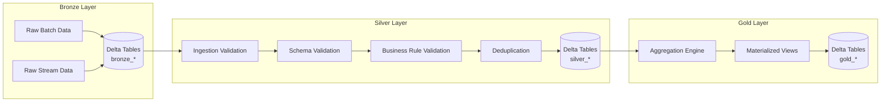
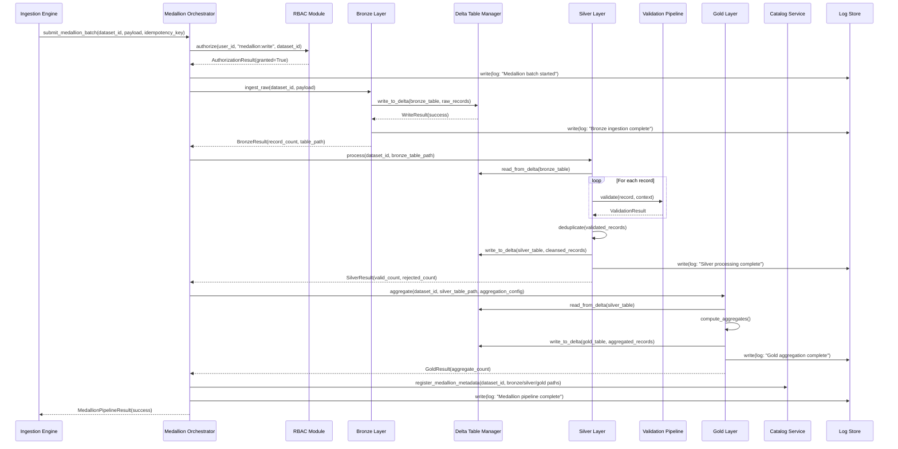
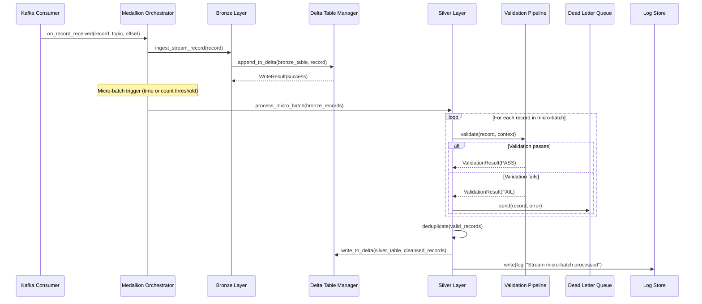

# Design Document: Databricks Medallion Integration

## Overview

This feature adds a new `andes_data_lake/databricks/` package that integrates Databricks with the existing Andes Data Lake. It implements the Medallion Architecture (Bronze → Silver → Gold) using Delta Lake on Databricks, connecting to the existing Iceberg/S3 storage, Kafka streaming, DynamoDB catalog, 3-layer validation pipeline, RBAC module, and Log Store.

The Bronze layer lands raw data as-is from both batch (Ingestion Engine) and streaming (Kafka consumer) sources. The Silver layer applies the existing 3-layer validation pipeline (Ingestion → Schema → Business Rule), deduplication, and schema enforcement to produce cleansed/conformed datasets. The Gold layer produces business-level aggregates curated for BI team consumption. Each layer is backed by Delta Lake tables on Databricks, with metadata tracked in the existing DynamoDB Catalog and all operations logged through the existing Log Store.

The integration follows the same design patterns established in the existing codebase: dependency injection, repository pattern, chain of responsibility (validation), event-driven logging, and structured error hierarchy.

## Architecture

```mermaid
graph TB
    subgraph Existing Andes Data Lake
        IE[Ingestion Engine]
        KF[Kafka Consumer]
        VP[Validation Pipeline<br/>Ingestion→Schema→BusinessRule]
        CAT[Catalog Service<br/>DynamoDB]
        RBAC[RBAC Module]
        LS[Log Store<br/>DynamoDB]
        ICE[(Iceberg/S3<br/>Source Storage)]
    end

    subgraph Databricks Medallion Package
        MO[Medallion Orchestrator]
        DTM[Delta Table Manager]
        BL[Bronze Layer Processor]
        SL[Silver Layer Processor]
        GL[Gold Layer Processor]
        DJM[Databricks Job Manager]
        DWC[Databricks Workspace Client]
    end

    subgraph Databricks Platform
        DBW[Databricks Workspace]
        DBC[Databricks Compute Clusters]
        DLT[(Delta Lake Tables)]
        UC[Unity Catalog]
    end

    IE -->|batch data| MO
    KF -->|stream data| MO
    MO --> BL
    BL -->|raw landing| DLT
    BL --> DTM
    MO --> SL
    SL -->|calls| VP
    SL -->|cleansed data| DLT
    SL --> DTM
    MO --> GL
    GL -->|aggregates| DLT
    GL --> DTM
    DTM --> DWC
    DWC --> DBW
    DJM --> DBC
    MO --> CAT
    MO --> RBAC
    MO --> LS
    SL --> LS
    GL --> LS
    BL --> LS
    DTM --> UC
    ICE -->|source reads| BL
end
```

### Medallion Layer Architecture



## Sequence Diagrams

### Batch Data Flow: Bronze → Silver → Gold



### Streaming Data Flow Through Medallion Layers



## Components and Interfaces

### Component 1: MedallionOrchestrator

**Purpose**: Top-level coordinator for medallion pipeline runs. Routes data through Bronze → Silver → Gold, manages idempotency, integrates with RBAC and Log Store.

**Interface**:
```python
class MedallionOrchestrator:
    def __init__(
        self,
        bronze_processor: BronzeLayerProcessor,
        silver_processor: SilverLayerProcessor,
        gold_processor: GoldLayerProcessor,
        catalog_service: CatalogService,
        rbac: RBACModule,
        log_store: LogStore,
        idempotency_store: IdempotencyStore,
    ): ...

    def submit_batch(
        self, dataset_id: str, payload: list[dict], idempotency_key: str, user_id: str
    ) -> MedallionPipelineResult: ...

    def process_stream_record(
        self, record: dict, topic: str, offset: int
    ) -> None: ...

    def trigger_gold_refresh(
        self, dataset_id: str, aggregation_config: AggregationConfig, user_id: str
    ) -> GoldResult: ...

    def get_pipeline_status(self, run_id: str) -> MedallionPipelineStatus: ...
```

**Responsibilities**:
- Authorize operations via RBAC before processing
- Check idempotency keys to prevent duplicate runs
- Coordinate Bronze → Silver → Gold flow
- Register medallion metadata in Catalog
- Log all pipeline events to Log Store

### Component 2: BronzeLayerProcessor

**Purpose**: Lands raw data as-is into Bronze Delta tables. No transformation or validation — preserves source fidelity.

**Interface**:
```python
class BronzeLayerProcessor:
    def __init__(
        self,
        delta_table_manager: DeltaTableManager,
        log_store: LogStore,
    ): ...

    def ingest_batch(
        self, dataset_id: str, records: list[dict], source_metadata: SourceMetadata
    ) -> BronzeResult: ...

    def ingest_stream_record(
        self, dataset_id: str, record: dict, topic: str, offset: int
    ) -> BronzeResult: ...
```

**Responsibilities**:
- Write raw records to Bronze Delta tables with ingestion metadata (timestamp, source, batch_id)
- Partition Bronze tables by ingestion date
- Append-only writes — never modify existing Bronze data

### Component 3: SilverLayerProcessor

**Purpose**: Reads from Bronze, applies the existing 3-layer validation pipeline, deduplicates, and writes cleansed data to Silver Delta tables.

**Interface**:
```python
class SilverLayerProcessor:
    def __init__(
        self,
        delta_table_manager: DeltaTableManager,
        validation_pipeline: ValidationPipeline,
        log_store: LogStore,
        dead_letter_queue: DeadLetterQueue,
    ): ...

    def process_batch(
        self, dataset_id: str, bronze_table_path: str, schema_context: dict
    ) -> SilverResult: ...

    def process_micro_batch(
        self, dataset_id: str, records: list[dict], schema_context: dict
    ) -> SilverResult: ...

    def deduplicate(
        self, records: list[dict], dedup_keys: list[str]
    ) -> list[dict]: ...
```

**Responsibilities**:
- Read raw records from Bronze Delta tables
- Run each record through the existing ValidationPipeline (Ingestion → Schema → Business Rule)
- Route failed records to the Dead Letter Queue
- Deduplicate records based on configurable keys
- Write cleansed, validated records to Silver Delta tables
- Enforce schema on Silver tables via Delta Lake schema enforcement

### Component 4: GoldLayerProcessor

**Purpose**: Reads from Silver and produces business-level aggregates for BI consumption.

**Interface**:
```python
class GoldLayerProcessor:
    def __init__(
        self,
        delta_table_manager: DeltaTableManager,
        log_store: LogStore,
    ): ...

    def aggregate(
        self, dataset_id: str, silver_table_path: str, config: AggregationConfig
    ) -> GoldResult: ...

    def refresh_materialized_view(
        self, view_name: str, config: AggregationConfig
    ) -> GoldResult: ...
```

**Responsibilities**:
- Read validated data from Silver Delta tables
- Apply aggregation logic defined in AggregationConfig (group-by, sum, avg, count, etc.)
- Write aggregated results to Gold Delta tables
- Support incremental refresh (process only new Silver data since last Gold run)

### Component 5: DeltaTableManager

**Purpose**: Manages Delta Lake table lifecycle — creation, schema evolution, reads, writes, and metadata registration with Unity Catalog.

**Interface**:
```python
class DeltaTableManager:
    def __init__(
        self,
        workspace_client: DatabricksWorkspaceClient,
        log_store: LogStore,
    ): ...

    def create_table(
        self, table_name: str, schema: DeltaSchema, layer: MedallionLayer, partition_keys: list[str]
    ) -> DeltaTableMetadata: ...

    def write(
        self, table_path: str, records: list[dict], mode: WriteMode
    ) -> WriteResult: ...

    def read(
        self, table_path: str, filters: dict | None = None
    ) -> list[dict]: ...

    def get_table_metadata(self, table_path: str) -> DeltaTableMetadata: ...

    def evolve_schema(
        self, table_path: str, new_schema: DeltaSchema
    ) -> DeltaTableMetadata: ...

    def optimize_table(self, table_path: str) -> None: ...

    def vacuum_table(self, table_path: str, retention_hours: int = 168) -> None: ...
```

**Responsibilities**:
- Create and manage Delta tables for each medallion layer
- Handle schema evolution when source schemas change
- Provide read/write abstraction over Delta Lake
- Register tables in Unity Catalog for governance
- Run OPTIMIZE and VACUUM for table maintenance

### Component 6: DatabricksWorkspaceClient

**Purpose**: Thin wrapper around the Databricks SDK for workspace operations — cluster management, job submission, and API calls.

**Interface**:
```python
class DatabricksWorkspaceClient:
    def __init__(
        self, host: str, token: str,
    ): ...

    def execute_sql(self, sql: str, warehouse_id: str) -> list[dict]: ...

    def submit_job(self, job_config: DatabricksJobConfig) -> JobRunResult: ...

    def get_job_status(self, run_id: str) -> JobRunStatus: ...

    def create_cluster(self, config: ClusterConfig) -> str: ...

    def terminate_cluster(self, cluster_id: str) -> None: ...
```

**Responsibilities**:
- Authenticate with Databricks workspace
- Execute SQL queries via Databricks SQL Warehouses
- Submit and monitor Databricks job runs
- Manage compute cluster lifecycle

### Component 7: DatabricksJobManager

**Purpose**: Defines and manages Databricks workflow jobs for scheduled medallion pipeline runs.

**Interface**:
```python
class DatabricksJobManager:
    def __init__(
        self,
        workspace_client: DatabricksWorkspaceClient,
        log_store: LogStore,
    ): ...

    def create_medallion_job(
        self, dataset_id: str, schedule: str, config: MedallionJobConfig
    ) -> DatabricksJobConfig: ...

    def trigger_job(self, job_id: str) -> JobRunResult: ...

    def get_job_run_status(self, run_id: str) -> JobRunStatus: ...

    def list_jobs(self, dataset_id: str | None = None) -> list[DatabricksJobConfig]: ...

    def delete_job(self, job_id: str) -> None: ...
```

**Responsibilities**:
- Create Databricks workflow definitions for medallion pipelines
- Support cron-based scheduling for batch runs
- Support triggered runs for on-demand processing
- Monitor job execution status and log outcomes

## Data Models

### MedallionLayer

```python
class MedallionLayer(str, Enum):
    BRONZE = "bronze"
    SILVER = "silver"
    GOLD = "gold"
```

### MedallionPipelineRun

```python
class MedallionPipelineRun(BaseModel):
    run_id: UUID                          # Partition key
    dataset_id: UUID                      # GSI
    idempotency_key: str                  # GSI, unique
    status: MedallionPipelineStatus       # RUNNING, COMPLETED, FAILED, ROLLED_BACK, SKIPPED
    current_layer: MedallionLayer         # Which layer is currently processing
    bronze_result: BronzeResult | None
    silver_result: SilverResult | None
    gold_result: GoldResult | None
    start_time: datetime
    end_time: datetime | None
    error_message: str | None
    correlation_id: str                   # For Log Store tracing
```

**Validation Rules**:
- `idempotency_key` must be unique across all runs
- `end_time` must be >= `start_time` when set
- `current_layer` must progress BRONZE → SILVER → GOLD (never skip or go backwards)

### BronzeResult

```python
class BronzeResult(BaseModel):
    record_count: int                     # Number of raw records landed
    table_path: str                       # Delta table path (e.g., "bronze.accounting_raw")
    ingestion_timestamp: datetime
    source_type: SourceType               # BATCH or STREAM
    source_metadata: SourceMetadata
```

### SilverResult

```python
class SilverResult(BaseModel):
    valid_count: int                      # Records that passed all 3 validation layers
    rejected_count: int                   # Records routed to DLQ
    deduplicated_count: int               # Records removed by deduplication
    table_path: str                       # Delta table path (e.g., "silver.accounting_cleansed")
    processing_timestamp: datetime
    validation_summary: ValidationSummary
```

### ValidationSummary

```python
class ValidationSummary(BaseModel):
    ingestion_pass: int
    ingestion_fail: int
    schema_pass: int
    schema_fail: int
    business_rule_pass: int
    business_rule_fail: int
```

### GoldResult

```python
class GoldResult(BaseModel):
    aggregate_count: int                  # Number of aggregate rows produced
    table_path: str                       # Delta table path (e.g., "gold.accounting_summary")
    aggregation_timestamp: datetime
    aggregation_type: str                 # Description of aggregation applied
    is_incremental: bool                  # Whether this was an incremental refresh
```

### AggregationConfig

```python
class AggregationConfig(BaseModel):
    group_by_columns: list[str]           # Columns to group by
    aggregations: list[AggregationSpec]   # List of aggregation operations
    filter_condition: str | None          # Optional SQL WHERE clause
    incremental: bool = True              # Whether to process only new data
    watermark_column: str = "processing_timestamp"  # Column for incremental tracking
```

### AggregationSpec

```python
class AggregationSpec(BaseModel):
    column: str                           # Source column name
    function: AggregationFunction         # SUM, AVG, COUNT, MIN, MAX, COUNT_DISTINCT
    alias: str                            # Output column name
```

### DeltaTableMetadata

```python
class DeltaTableMetadata(BaseModel):
    table_name: str                       # Fully qualified name (catalog.schema.table)
    layer: MedallionLayer
    delta_schema: DeltaSchema
    partition_keys: list[str]
    location: str                         # Storage path
    created_at: datetime
    last_modified: datetime
    row_count: int
    size_bytes: int
```

### DeltaSchema

```python
class DeltaSchema(BaseModel):
    columns: list[DeltaColumn]

class DeltaColumn(BaseModel):
    name: str
    data_type: str                        # Delta Lake type (STRING, LONG, DOUBLE, TIMESTAMP, etc.)
    nullable: bool = True
    comment: str | None = None
```

### WriteMode

```python
class WriteMode(str, Enum):
    APPEND = "append"
    OVERWRITE = "overwrite"
    MERGE = "merge"
```

### SourceType and SourceMetadata

```python
class SourceType(str, Enum):
    BATCH = "batch"
    STREAM = "stream"

class SourceMetadata(BaseModel):
    source_type: SourceType
    source_system: str                    # e.g., "ingestion_engine", "kafka_consumer"
    batch_id: str | None = None           # For batch sources
    topic: str | None = None              # For stream sources
    offset: int | None = None             # For stream sources
    partition: int | None = None          # For stream sources
```

### DatabricksJobConfig

```python
class DatabricksJobConfig(BaseModel):
    job_id: str
    job_name: str
    dataset_id: str
    schedule_cron: str | None             # Cron expression for scheduled runs
    cluster_config: ClusterConfig
    medallion_config: MedallionJobConfig
    created_at: datetime
    updated_at: datetime
```

### MedallionJobConfig

```python
class MedallionJobConfig(BaseModel):
    dataset_id: str
    bronze_enabled: bool = True
    silver_enabled: bool = True
    gold_enabled: bool = True
    aggregation_config: AggregationConfig | None = None
    dedup_keys: list[str] = []
    micro_batch_size: int = 1000          # For streaming: records per micro-batch
    micro_batch_interval_seconds: int = 60  # For streaming: time trigger
```

### ClusterConfig

```python
class ClusterConfig(BaseModel):
    num_workers: int = 2
    spark_version: str = "13.3.x-scala2.12"
    node_type_id: str = "i3.xlarge"
    autoscale_min: int | None = None
    autoscale_max: int | None = None
```

### MedallionPipelineStatus

```python
class MedallionPipelineStatus(str, Enum):
    RUNNING = "RUNNING"
    COMPLETED = "COMPLETED"
    FAILED = "FAILED"
    ROLLED_BACK = "ROLLED_BACK"
    SKIPPED = "SKIPPED"                   # Idempotent duplicate
```

### JobRunStatus

```python
class JobRunStatus(str, Enum):
    PENDING = "PENDING"
    RUNNING = "RUNNING"
    SUCCEEDED = "SUCCEEDED"
    FAILED = "FAILED"
    CANCELLED = "CANCELLED"
```


## Key Functions with Formal Specifications

### Function 1: MedallionOrchestrator.submit_batch()

```python
def submit_batch(
    self, dataset_id: str, payload: list[dict], idempotency_key: str, user_id: str
) -> MedallionPipelineResult:
```

**Preconditions:**
- `dataset_id` references a dataset registered in the Catalog
- `payload` is a non-empty list of dict records
- `idempotency_key` is a non-empty string
- `user_id` is a valid user with an assigned role

**Postconditions:**
- If `idempotency_key` was already completed: returns original result, no re-execution, data lake state unchanged
- If RBAC denies: raises `AuthorizationDeniedError`, no data written
- If successful: Bronze, Silver, and Gold tables contain the processed data; Catalog metadata updated; all events logged
- If any layer fails: all writes from the current run are rolled back; status set to FAILED

**Loop Invariants:** N/A

### Function 2: BronzeLayerProcessor.ingest_batch()

```python
def ingest_batch(
    self, dataset_id: str, records: list[dict], source_metadata: SourceMetadata
) -> BronzeResult:
```

**Preconditions:**
- `records` is a non-empty list
- `source_metadata.source_type` is `BATCH`
- Bronze Delta table for `dataset_id` exists or will be auto-created

**Postconditions:**
- All records are written to the Bronze Delta table with ingestion metadata appended (ingestion_timestamp, source_system, batch_id)
- `BronzeResult.record_count` equals `len(records)`
- No transformation applied to record content — raw fidelity preserved
- Write is atomic — either all records land or none do

**Loop Invariants:** N/A

### Function 3: SilverLayerProcessor.process_batch()

```python
def process_batch(
    self, dataset_id: str, bronze_table_path: str, schema_context: dict
) -> SilverResult:
```

**Preconditions:**
- `bronze_table_path` references an existing Bronze Delta table with records
- `schema_context` contains a valid `SchemaDefinition` and business rules for the dataset
- The existing `ValidationPipeline` is initialized with all 3 layers

**Postconditions:**
- Every record from Bronze is passed through the 3-layer validation pipeline
- Records passing all 3 layers are written to the Silver Delta table
- Records failing any layer are routed to the Dead Letter Queue with error details
- `SilverResult.valid_count + SilverResult.rejected_count == total_bronze_records`
- Deduplication removes exact duplicates based on configured dedup keys
- `SilverResult.deduplicated_count` reflects records removed by dedup
- Validation audit records are created for every processed record

**Loop Invariants:**
- For the validation loop: `processed_count == valid_count + rejected_count` at each iteration
- All previously validated records maintain their validation status

### Function 4: SilverLayerProcessor.deduplicate()

```python
def deduplicate(
    self, records: list[dict], dedup_keys: list[str]
) -> list[dict]:
```

**Preconditions:**
- `records` is a list of validated records
- `dedup_keys` is a non-empty list of field names present in all records

**Postconditions:**
- Returned list contains no duplicate records based on `dedup_keys`
- For duplicate groups, the record with the latest timestamp is retained
- `len(result) <= len(records)`
- All records in result were present in input (no fabrication)

**Loop Invariants:**
- The seen-keys set grows monotonically
- Each output record has a unique combination of dedup_key values

### Function 5: GoldLayerProcessor.aggregate()

```python
def aggregate(
    self, dataset_id: str, silver_table_path: str, config: AggregationConfig
) -> GoldResult:
```

**Preconditions:**
- `silver_table_path` references an existing Silver Delta table
- `config.group_by_columns` are valid column names in the Silver table
- `config.aggregations` contains at least one `AggregationSpec`

**Postconditions:**
- Gold Delta table contains one row per unique combination of `group_by_columns`
- Each aggregation function is correctly applied to its source column
- If `config.incremental` is True: only Silver records newer than the last Gold watermark are processed
- If `config.incremental` is False: Gold table is fully recomputed from Silver
- `GoldResult.aggregate_count` equals the number of rows written to Gold

**Loop Invariants:** N/A (aggregation is a set operation, not iterative)

### Function 6: DeltaTableManager.write()

```python
def write(
    self, table_path: str, records: list[dict], mode: WriteMode
) -> WriteResult:
```

**Preconditions:**
- `table_path` references a valid Delta table location
- `records` is a non-empty list conforming to the table's schema
- `mode` is one of APPEND, OVERWRITE, or MERGE

**Postconditions:**
- If `mode == APPEND`: records are added to the table; existing data unchanged
- If `mode == OVERWRITE`: table data is replaced with the new records
- If `mode == MERGE`: records are upserted based on primary key
- Write is atomic — either all records are committed or none are
- Table metadata (row_count, size_bytes, last_modified) is updated

**Loop Invariants:** N/A

### Function 7: DeltaTableManager.create_table()

```python
def create_table(
    self, table_name: str, schema: DeltaSchema, layer: MedallionLayer, partition_keys: list[str]
) -> DeltaTableMetadata:
```

**Preconditions:**
- `table_name` follows naming convention: `{layer}_{dataset_name}` (e.g., `bronze_accounting_raw`)
- `schema.columns` is non-empty
- `partition_keys` are valid column names in `schema`
- Table does not already exist at the target location

**Postconditions:**
- Delta table is created in the Databricks workspace
- Table is registered in Unity Catalog
- Returned `DeltaTableMetadata` reflects the created table's properties
- Table is partitioned by the specified keys

**Loop Invariants:** N/A

## Algorithmic Pseudocode

### Main Processing Algorithm: Medallion Batch Pipeline

```python
def execute_medallion_batch(orchestrator, dataset_id, payload, idempotency_key, user_id):
    """
    INPUT: dataset_id, payload (list of records), idempotency_key, user_id
    OUTPUT: MedallionPipelineResult
    """
    # Step 0: Idempotency check
    existing = orchestrator.idempotency_store.check_and_reserve(idempotency_key)
    if existing is not None:
        return existing  # SKIPPED — duplicate run

    # Step 1: Authorization
    auth_result = orchestrator.rbac.authorize(user_id, "medallion:write", dataset_id)
    assert auth_result.granted, "User must be authorized"

    # Step 2: Create pipeline run record
    run = MedallionPipelineRun(
        run_id=uuid4(),
        dataset_id=dataset_id,
        idempotency_key=idempotency_key,
        status=MedallionPipelineStatus.RUNNING,
        current_layer=MedallionLayer.BRONZE,
        start_time=datetime.utcnow(),
        correlation_id=str(uuid4()),
    )
    orchestrator.log_store.write(LogEntry(
        source_component="MedallionOrchestrator",
        message=f"Pipeline {run.run_id} started for dataset {dataset_id}",
        severity=Severity.INFO,
        correlation_id=run.correlation_id,
    ))

    try:
        # Step 3: Bronze — land raw data
        run.current_layer = MedallionLayer.BRONZE
        source_meta = SourceMetadata(source_type=SourceType.BATCH, source_system="ingestion_engine")
        bronze_result = orchestrator.bronze_processor.ingest_batch(dataset_id, payload, source_meta)
        run.bronze_result = bronze_result
        assert bronze_result.record_count == len(payload), "All records must land in Bronze"

        # Step 4: Silver — validate, deduplicate, cleanse
        run.current_layer = MedallionLayer.SILVER
        schema_context = orchestrator.catalog_service.get_dataset(dataset_id)
        silver_result = orchestrator.silver_processor.process_batch(
            dataset_id, bronze_result.table_path, schema_context
        )
        run.silver_result = silver_result
        assert silver_result.valid_count + silver_result.rejected_count == bronze_result.record_count

        # Step 5: Gold — aggregate (if configured)
        run.current_layer = MedallionLayer.GOLD
        if orchestrator.has_gold_config(dataset_id):
            gold_config = orchestrator.get_gold_config(dataset_id)
            gold_result = orchestrator.gold_processor.aggregate(
                dataset_id, silver_result.table_path, gold_config
            )
            run.gold_result = gold_result

        # Step 6: Register metadata
        orchestrator.catalog_service.register_medallion_metadata(
            dataset_id, bronze_result, silver_result, run.gold_result
        )

        run.status = MedallionPipelineStatus.COMPLETED
        run.end_time = datetime.utcnow()
        orchestrator.idempotency_store.mark_completed(idempotency_key, run)

        return MedallionPipelineResult(success=True, run=run)

    except Exception as e:
        run.status = MedallionPipelineStatus.FAILED
        run.error_message = str(e)
        run.end_time = datetime.utcnow()
        orchestrator.log_store.write(LogEntry(
            source_component="MedallionOrchestrator",
            message=f"Pipeline {run.run_id} failed at {run.current_layer}: {e}",
            severity=Severity.ERROR,
            correlation_id=run.correlation_id,
        ))
        raise
```

### Silver Layer Validation Algorithm

```python
def process_silver_batch(silver_processor, dataset_id, bronze_table_path, schema_context):
    """
    INPUT: dataset_id, bronze_table_path, schema_context (schema + business rules)
    OUTPUT: SilverResult

    PRECONDITION: bronze_table_path contains raw records
    POSTCONDITION: valid records in Silver table, rejected records in DLQ
    INVARIANT: processed_count == valid_count + rejected_count at each iteration
    """
    records = silver_processor.delta_table_manager.read(bronze_table_path)
    valid_records = []
    rejected_count = 0
    validation_summary = ValidationSummary()

    for record in records:
        # INVARIANT: len(valid_records) + rejected_count == records processed so far
        result, audit = silver_processor.validation_pipeline.validate(record, schema_context)

        # Update validation summary counters
        update_summary(validation_summary, audit)

        if result.status == ValidationStatus.PASS:
            valid_records.append(record)
        else:
            silver_processor.dead_letter_queue.send(
                source_stream=f"medallion_silver_{dataset_id}",
                record=record,
                error=result.error_message,
            )
            rejected_count += 1

        silver_processor.log_store.write(LogEntry(
            source_component="SilverLayerProcessor",
            message=f"Record validation: {result.status.value}",
            severity=Severity.INFO if result.status == ValidationStatus.PASS else Severity.WARN,
        ))

    # Deduplication
    dedup_keys = schema_context.get("dedup_keys", schema_context["schema"].primary_key)
    deduped_records = silver_processor.deduplicate(valid_records, dedup_keys)
    deduplicated_count = len(valid_records) - len(deduped_records)

    # Write to Silver Delta table
    silver_table_path = f"silver.{dataset_id}_cleansed"
    silver_processor.delta_table_manager.write(silver_table_path, deduped_records, WriteMode.APPEND)

    return SilverResult(
        valid_count=len(deduped_records),
        rejected_count=rejected_count,
        deduplicated_count=deduplicated_count,
        table_path=silver_table_path,
        processing_timestamp=datetime.utcnow(),
        validation_summary=validation_summary,
    )
```

### Gold Layer Aggregation Algorithm

```python
def aggregate_gold(gold_processor, dataset_id, silver_table_path, config):
    """
    INPUT: dataset_id, silver_table_path, AggregationConfig
    OUTPUT: GoldResult

    PRECONDITION: silver_table_path contains validated records
    POSTCONDITION: Gold table contains aggregated rows, one per group_by combination
    """
    # Determine read scope
    if config.incremental:
        last_watermark = gold_processor.get_last_watermark(dataset_id)
        filters = {config.watermark_column: {"gte": last_watermark}} if last_watermark else None
    else:
        filters = None

    if config.filter_condition:
        filters = merge_filters(filters, parse_condition(config.filter_condition))

    records = gold_processor.delta_table_manager.read(silver_table_path, filters=filters)

    # Group records
    groups = group_by(records, config.group_by_columns)

    # Apply aggregations
    aggregated_rows = []
    for group_key, group_records in groups.items():
        row = dict(zip(config.group_by_columns, group_key))
        for agg_spec in config.aggregations:
            values = [r[agg_spec.column] for r in group_records if agg_spec.column in r]
            row[agg_spec.alias] = apply_aggregation(agg_spec.function, values)
        aggregated_rows.append(row)

    # Write to Gold
    gold_table_path = f"gold.{dataset_id}_summary"
    write_mode = WriteMode.MERGE if config.incremental else WriteMode.OVERWRITE
    gold_processor.delta_table_manager.write(gold_table_path, aggregated_rows, write_mode)

    # Update watermark
    if config.incremental and records:
        new_watermark = max(r[config.watermark_column] for r in records)
        gold_processor.set_watermark(dataset_id, new_watermark)

    return GoldResult(
        aggregate_count=len(aggregated_rows),
        table_path=gold_table_path,
        aggregation_timestamp=datetime.utcnow(),
        aggregation_type=describe_aggregation(config),
        is_incremental=config.incremental,
    )
```

### Stream Micro-Batch Processing Algorithm

```python
def process_stream_micro_batch(orchestrator, buffer, dataset_id, schema_context):
    """
    INPUT: buffer (accumulated stream records), dataset_id, schema_context
    OUTPUT: None (side effects: Bronze + Silver tables updated)

    PRECONDITION: buffer contains 1..micro_batch_size records
    POSTCONDITION: all records landed in Bronze; valid records in Silver; invalid in DLQ
    """
    # Bronze: land raw
    source_meta = SourceMetadata(source_type=SourceType.STREAM, source_system="kafka_consumer")
    bronze_result = orchestrator.bronze_processor.ingest_batch(dataset_id, buffer, source_meta)

    # Silver: validate + cleanse
    silver_result = orchestrator.silver_processor.process_micro_batch(
        dataset_id, buffer, schema_context
    )

    orchestrator.log_store.write(LogEntry(
        source_component="MedallionOrchestrator",
        message=f"Stream micro-batch: {bronze_result.record_count} bronze, "
                f"{silver_result.valid_count} silver, {silver_result.rejected_count} rejected",
        severity=Severity.INFO,
    ))

    # Gold refresh is NOT triggered per micro-batch — it runs on a schedule
```

## Example Usage

```python
# --- Wiring dependencies (composition root) ---
from andes_data_lake.databricks.medallion_orchestrator import MedallionOrchestrator
from andes_data_lake.databricks.bronze_processor import BronzeLayerProcessor
from andes_data_lake.databricks.silver_processor import SilverLayerProcessor
from andes_data_lake.databricks.gold_processor import GoldLayerProcessor
from andes_data_lake.databricks.delta_table_manager import DeltaTableManager
from andes_data_lake.databricks.workspace_client import DatabricksWorkspaceClient
from andes_data_lake.databricks.job_manager import DatabricksJobManager
from andes_data_lake.validation.pipeline import ValidationPipeline
from andes_data_lake.catalog.catalog_service import CatalogService
from andes_data_lake.rbac.rbac_module import RBACModule
from andes_data_lake.logging_store.log_store import LogStore
from andes_data_lake.streaming.dead_letter_queue import DeadLetterQueue

# Initialize Databricks client
workspace_client = DatabricksWorkspaceClient(
    host="https://my-workspace.cloud.databricks.com",
    token="dapi_token_here",
)

# Build medallion components
delta_mgr = DeltaTableManager(workspace_client=workspace_client, log_store=log_store)
bronze = BronzeLayerProcessor(delta_table_manager=delta_mgr, log_store=log_store)
silver = SilverLayerProcessor(
    delta_table_manager=delta_mgr,
    validation_pipeline=ValidationPipeline(),
    log_store=log_store,
    dead_letter_queue=DeadLetterQueue(dynamo_client),
)
gold = GoldLayerProcessor(delta_table_manager=delta_mgr, log_store=log_store)

orchestrator = MedallionOrchestrator(
    bronze_processor=bronze,
    silver_processor=silver,
    gold_processor=gold,
    catalog_service=catalog_service,
    rbac=rbac_module,
    log_store=log_store,
    idempotency_store=idempotency_store,
)

# --- Example 1: Batch medallion pipeline ---
result = orchestrator.submit_batch(
    dataset_id="ds-accounting-2024",
    payload=[
        {"record_id": "r1", "timestamp": "2024-01-15T10:00:00Z", "source": "erp", "debit": 1000, "credit": 1000},
        {"record_id": "r2", "timestamp": "2024-01-15T10:01:00Z", "source": "erp", "debit": 500, "credit": 500},
    ],
    idempotency_key="batch-2024-01-15-001",
    user_id="controllership-user-1",
)
# result.run.bronze_result.record_count == 2
# result.run.silver_result.valid_count == 2 (assuming both pass validation)
# result.run.gold_result.aggregate_count == N (depends on aggregation config)

# --- Example 2: Trigger Gold refresh independently ---
gold_result = orchestrator.trigger_gold_refresh(
    dataset_id="ds-accounting-2024",
    aggregation_config=AggregationConfig(
        group_by_columns=["source", "month"],
        aggregations=[
            AggregationSpec(column="debit", function=AggregationFunction.SUM, alias="total_debit"),
            AggregationSpec(column="credit", function=AggregationFunction.SUM, alias="total_credit"),
            AggregationSpec(column="record_id", function=AggregationFunction.COUNT, alias="transaction_count"),
        ],
        incremental=True,
    ),
    user_id="controllership-user-1",
)

# --- Example 3: Schedule a Databricks job for recurring medallion runs ---
job_manager = DatabricksJobManager(workspace_client=workspace_client, log_store=log_store)
job = job_manager.create_medallion_job(
    dataset_id="ds-accounting-2024",
    schedule="0 6 * * *",  # Daily at 6 AM
    config=MedallionJobConfig(
        dataset_id="ds-accounting-2024",
        bronze_enabled=True,
        silver_enabled=True,
        gold_enabled=True,
        aggregation_config=AggregationConfig(
            group_by_columns=["source"],
            aggregations=[
                AggregationSpec(column="debit", function=AggregationFunction.SUM, alias="total_debit"),
            ],
        ),
        dedup_keys=["record_id"],
    ),
)

# --- Example 4: Create Delta tables for a new dataset ---
bronze_table = delta_mgr.create_table(
    table_name="bronze_accounting_raw",
    schema=DeltaSchema(columns=[
        DeltaColumn(name="record_id", data_type="STRING", nullable=False),
        DeltaColumn(name="timestamp", data_type="TIMESTAMP", nullable=False),
        DeltaColumn(name="source", data_type="STRING"),
        DeltaColumn(name="debit", data_type="DOUBLE"),
        DeltaColumn(name="credit", data_type="DOUBLE"),
        DeltaColumn(name="_ingestion_timestamp", data_type="TIMESTAMP"),
        DeltaColumn(name="_source_system", data_type="STRING"),
        DeltaColumn(name="_batch_id", data_type="STRING"),
    ]),
    layer=MedallionLayer.BRONZE,
    partition_keys=["_ingestion_timestamp"],
)
```


## Correctness Properties

*A property is a characteristic or behavior that should hold true across all valid executions of a system-essentially, a formal statement about what the system should do. Properties serve as the bridge between human-readable specifications and machine-verifiable correctness guarantees.*

### Property 1: Bronze layer raw fidelity

*For any* batch of records submitted to the Bronze layer, reading back from the Bronze Delta table should return records whose content is identical to the original input (no transformation, no field modification), with additional ingestion metadata fields appended.

**Validates: Requirements 1.1, 1.2, 1.3, 2.1**

### Property 2: Medallion layer progression

*For any* medallion pipeline run that completes successfully, the `current_layer` must have progressed through BRONZE → SILVER → GOLD in order, and the pipeline status must be COMPLETED. No layer may be skipped or processed out of order.

**Validates: Requirements 8.1, 8.2, 8.3**

### Property 3: Silver validation completeness

*For any* set of records processed by the Silver layer, the sum of `valid_count` and `rejected_count` must equal the total number of records read from the Bronze table. Every record must be either written to Silver or routed to the Dead Letter Queue — none may be silently dropped.

**Validates: Requirements 3.3, 16.2**

### Property 4: Silver deduplication correctness

*For any* set of records with duplicate values on the configured dedup keys, the Silver layer output should contain exactly one record per unique dedup key combination, and the retained record should be the one with the latest timestamp. All output records must be a subset of the input records.

**Validates: Requirements 4.1, 4.2, 4.3, 4.4**

### Property 5: Silver validation pipeline integration

*For any* record processed by the Silver layer, the existing 3-layer validation pipeline (Ingestion → Schema → Business Rule) must be invoked in order. A record that fails at layer N should not be passed to layer N+1, and the validation audit record should reflect the outcome of each executed layer.

**Validates: Requirements 3.1, 3.2, 3.4**

### Property 6: Gold aggregation correctness

*For any* aggregation configuration applied to a Silver table, the Gold output should contain exactly one row per unique combination of `group_by_columns`, and each aggregation value (SUM, AVG, COUNT, MIN, MAX) should be mathematically correct for the corresponding group.

**Validates: Requirements 6.1, 6.2, 6.3, 6.4**

### Property 7: Gold incremental consistency

*For any* incremental Gold refresh, the resulting Gold table should be equivalent to a full recomputation from the complete Silver table. That is, running incremental refresh N times should produce the same result as a single full refresh.

**Validates: Requirements 7.1, 7.2, 7.3**

### Property 8: Medallion pipeline idempotency

*For any* successfully completed medallion pipeline run, re-submitting with the same idempotency key should return the original result without re-executing any layer, and the Bronze, Silver, and Gold tables should remain unchanged.

**Validates: Requirements 9.1, 9.2, 9.3**

### Property 9: RBAC enforcement on medallion operations

*For any* medallion pipeline submission, the orchestrator must check RBAC authorization before processing. If the user lacks the required permission, no data should be written to any medallion layer, and an `AuthorizationDeniedError` should be raised.

**Validates: Requirements 14.1, 14.2, 14.3**

### Property 10: Medallion pipeline logging completeness

*For any* medallion pipeline run (successful or failed), the Log Store should contain entries for: pipeline start, each layer's start and completion (or failure), and pipeline end. Each entry should include the correlation ID for end-to-end tracing.

**Validates: Requirements 15.1, 15.2, 15.3, 15.4, 15.5**

### Property 11: Delta table write atomicity

*For any* write operation to a Delta table (Bronze, Silver, or Gold), either all records are committed or none are. There should be no state where a partial set of records from a single write is visible.

**Validates: Requirement 10.2**

### Property 12: Stream micro-batch Bronze landing

*For any* stream micro-batch, all records in the batch must be landed in the Bronze Delta table before Silver processing begins. The Bronze record count must equal the micro-batch size.

**Validates: Requirement 2.3**

### Property 13: Delta table schema enforcement

*For any* write to a Silver or Gold Delta table, records that do not conform to the table's schema must be rejected. The Delta table should never contain records that violate its schema definition.

**Validates: Requirement 5.1**

### Property 14: Medallion pipeline failure rollback

*For any* medallion pipeline run that fails at any layer, the pipeline status should be set to FAILED, the error should be logged with the correlation ID, and the failure should not corrupt data written by previous successful runs.

**Validates: Requirements 8.4, 16.1, 16.3**

## Error Handling

### Medallion Pipeline Errors

| Error Scenario | Component | Behavior |
|---|---|---|
| Unauthorized medallion operation | MedallionOrchestrator | Raise `AuthorizationDeniedError`, no data written to any layer |
| Duplicate idempotency key | MedallionOrchestrator | Return original result with `SKIPPED` status, no re-execution |
| Bronze write failure | BronzeLayerProcessor | Log error, set pipeline status to `FAILED`, propagate exception |
| Silver validation failure (record-level) | SilverLayerProcessor | Route individual record to DLQ, continue processing remaining records |
| Silver batch failure (system-level) | SilverLayerProcessor | Log error, set pipeline status to `FAILED`, propagate exception |
| Gold aggregation failure | GoldLayerProcessor | Log error, set pipeline status to `FAILED`; Bronze and Silver data remain intact |
| Delta table creation failure | DeltaTableManager | Raise `DeltaTableError` with table name and cause |
| Delta schema mismatch on write | DeltaTableManager | Raise `SchemaViolationError` with column details |
| Databricks workspace unreachable | DatabricksWorkspaceClient | Raise `DatabricksConnectionError`, circuit breaker buffers retries |
| Databricks job failure | DatabricksJobManager | Log failure, set job status to `FAILED`, notify via Log Store |
| Stream micro-batch timeout | MedallionOrchestrator | Flush partial batch, log warning, continue with next batch |

### Error Propagation Strategy

Errors follow the existing Andes error hierarchy:

```python
class MedallionError(AndesError):
    """Base exception for medallion pipeline errors."""
    code = "MEDALLION_ERROR"

class BronzeIngestionError(MedallionError):
    code = "BRONZE_INGESTION_ERROR"

class SilverProcessingError(MedallionError):
    code = "SILVER_PROCESSING_ERROR"

class GoldAggregationError(MedallionError):
    code = "GOLD_AGGREGATION_ERROR"

class DeltaTableError(MedallionError):
    code = "DELTA_TABLE_ERROR"

class DatabricksConnectionError(MedallionError):
    code = "DATABRICKS_CONNECTION_ERROR"
```

## Testing Strategy

### Dual Testing Approach

Consistent with the existing Andes Data Lake testing strategy, this feature uses both unit tests and property-based tests.

- Unit tests: Verify specific examples, edge cases, integration points between medallion layers and existing components
- Property-based tests: Verify universal properties across randomly generated inputs (minimum 100 iterations per property)

### Property-Based Testing Configuration

- Library: [Hypothesis](https://hypothesis.readthedocs.io/) (Python)
- Minimum iterations: 100 per property test
- Tag format: `Feature: databricks-medallion-integration, Property {number}: {property_text}`
- Each correctness property must be implemented by a single property-based test

### Unit Test Coverage

Unit tests should focus on:

1. Specific examples: Known accounting records through Bronze → Silver → Gold, specific aggregation configs
2. Edge cases: Empty payloads, single-record batches, all-invalid batches (100% DLQ), zero-group aggregations
3. Error conditions: All error scenarios from the Error Handling section
4. Integration points: Silver ↔ existing ValidationPipeline, Orchestrator ↔ existing RBAC, Orchestrator ↔ existing LogStore, Orchestrator ↔ existing CatalogService, Orchestrator ↔ existing IdempotencyStore

### Property Test Coverage

| Property | Test Focus | Generator Strategy |
|---|---|---|
| 1: Bronze raw fidelity | Data preservation | Random dicts with varied field types and values |
| 2: Medallion layer progression | State machine | Random pipeline configs (layers enabled/disabled) |
| 3: Silver validation completeness | Record accounting | Random records (mix of valid and invalid) |
| 4: Silver deduplication correctness | Dedup logic | Random records with controlled duplicate keys |
| 5: Silver validation pipeline integration | Pipeline ordering | Records designed to fail at each validation layer |
| 6: Gold aggregation correctness | Math accuracy | Random numeric records with known group-by keys |
| 7: Gold incremental consistency | Incremental vs full | Random Silver data split across multiple batches |
| 8: Medallion pipeline idempotency | Duplicate detection | Random payloads with repeated idempotency keys |
| 9: RBAC enforcement | Authorization | Random user-role combinations with medallion actions |
| 10: Pipeline logging completeness | Log presence | Random pipeline runs (success and failure) |
| 11: Delta table write atomicity | All-or-nothing | Random records with injected write failures |
| 12: Stream micro-batch Bronze landing | Record count | Random micro-batch sizes and record content |
| 13: Delta schema enforcement | Schema validation | Random records with schema-violating fields |
| 14: Pipeline failure rollback | State consistency | Random failure injection at each layer |

## Performance Considerations

- Bronze writes use APPEND mode exclusively — no read-modify-write overhead
- Silver processing parallelizes validation across Spark executors on Databricks clusters
- Gold aggregations leverage Spark's distributed GROUP BY — scales with cluster size
- Delta Lake OPTIMIZE (Z-ORDER) should be scheduled on Silver and Gold tables for query performance
- Delta Lake VACUUM should run weekly to reclaim storage from old file versions
- Streaming micro-batches are sized to balance latency (smaller batches) vs throughput (larger batches) — configurable via `micro_batch_size` and `micro_batch_interval_seconds`
- Unity Catalog caching reduces metadata lookup overhead for repeated table access

## Security Considerations

- All medallion operations are gated by the existing RBAC module — no bypass path
- Databricks workspace authentication uses personal access tokens stored in a secrets manager (never hardcoded)
- Unity Catalog enforces table-level and column-level access control on Databricks
- Bronze tables may contain PII — Silver layer should apply masking/redaction as part of cleansing (configurable per dataset)
- All Databricks API calls use HTTPS
- Cluster auto-termination is enabled to prevent idle compute costs and reduce attack surface

## Dependencies

| Dependency | Purpose | Version |
|---|---|---|
| databricks-sdk | Databricks workspace API client | >= 0.20.0 |
| delta-spark | Delta Lake Python bindings | >= 3.0.0 |
| pyspark | Spark runtime for Delta operations | >= 3.5.0 |
| pydantic | Data model validation (existing) | >= 2.0 |
| boto3 | DynamoDB access for catalog/logging (existing) | >= 1.28 |
| hypothesis | Property-based testing (existing) | >= 6.0 |
| pytest | Test runner (existing) | >= 7.0 |

### Existing Andes Components Used

| Component | Integration Point |
|---|---|
| `validation.pipeline.ValidationPipeline` | Silver layer calls the 3-layer validation chain |
| `catalog.catalog_service.CatalogService` | Medallion metadata registration |
| `rbac.rbac_module.RBACModule` | Authorization for all medallion operations |
| `logging_store.log_store.LogStore` | Pipeline observability and audit logging |
| `streaming.dead_letter_queue.DeadLetterQueue` | Silver layer routes invalid records to DLQ |
| `ingestion.idempotency.IdempotencyStore` | Duplicate pipeline run detection |
| `models.errors.AndesError` | Error hierarchy base class |
