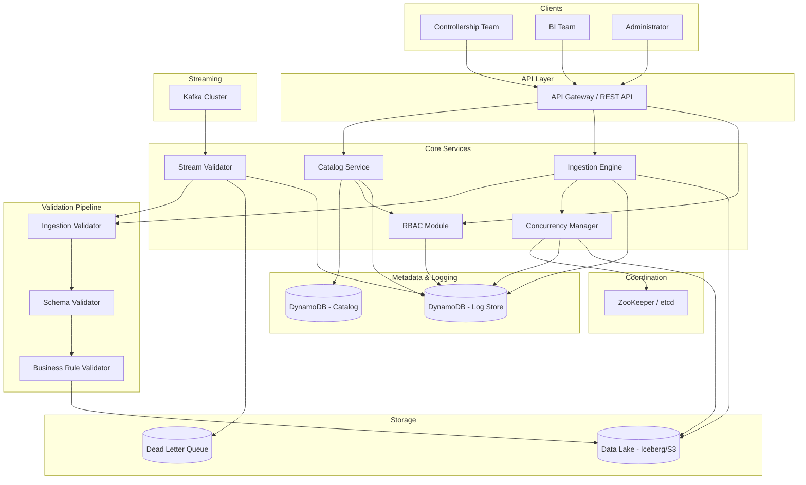

# Andes Data Lake — Complete Documentation

## 1. Introduction

Andes Data Lake is a centralized, ACID-compliant data lake for accounting datasets. It enables the upstream Controllership Team to publish datasets and the BI Team to discover and subscribe to them. The system supports both batch-ingested and live-streamed data (e.g., from stock markets), with pipelines that are reliable, consistent, and idempotent. Multi-layer validation, role-based access control, distributed concurrency handling, and centralized logging ensure data quality, security, and operational visibility.

---

## 2. System Architecture

### 2.1 High-Level Architecture Diagram



### 2.2 Key Design Decisions

| Decision | Technology | Rationale |
|---|---|---|
| Storage Layer | Apache Iceberg on S3 | ACID transactions, schema evolution, versioning, time-travel queries on object storage |
| Live Stream Ingestion | Apache Kafka | Durable, ordered, replayable event streams with consumer group offset management |
| Metadata & Logging | DynamoDB | Single-digit ms latency, horizontal scalability, strong consistency |
| Conflict Resolution | Optimistic Concurrency Control (OCC) | Version tokens detect/resolve write conflicts without pessimistic locking overhead |
| Distributed Coordination | ZooKeeper / etcd | Distributed locks, leader election, lease management |

### 2.3 Data Flow Paths

1. **Batch Publishing**: Controllership Team → API → Ingestion Engine → Validation Pipeline (3 layers) → Data Lake (Iceberg/S3). Catalog metadata registered in DynamoDB.
2. **Live Streaming**: Kafka → Stream Validator → Validation Pipeline → Data Lake. Invalid records routed to Dead Letter Queue.
3. **Discovery & Subscription**: BI Team → API → Catalog Service → DynamoDB (metadata). Subscription requests flow through RBAC for authorization.
4. **Concurrency Coordination**: Ingestion Engine → Concurrency Manager → ZooKeeper/etcd for distributed locks and leader election.
5. **Logging**: All components → DynamoDB Log Store with correlation IDs for end-to-end tracing.

---

## 3. Components

### 3.1 Catalog Service

Manages dataset metadata, discoverability, and subscription lifecycle.

```
CatalogService:
  registerDataset(name, schema, owner, description) → DatasetMetadata
  getDataset(datasetId) → DatasetMetadata
  listDatasets(filters?) → DatasetMetadata[]
  searchDatasets(keyword) → DatasetMetadata[]
  getVersionHistory(datasetId) → Version[]
  createSubscriptionRequest(datasetId, userId) → SubscriptionRequest
  approveSubscription(subscriptionId) → Subscription
  rejectSubscription(subscriptionId, reason) → Subscription
  revokeSubscription(subscriptionId) → Subscription
  listSubscriptions(datasetId) → Subscription[]
```

### 3.2 Ingestion Engine

Orchestrates pipeline runs with idempotency, atomicity, and multi-layer validation.

```
IngestionEngine:
  submitBatch(datasetId, payload, idempotencyKey) → PipelineRunResult
  getPipelineRunStatus(runId) → PipelineRunStatus
  rollbackRun(runId) → void
  commitRun(runId) → void
```

### 3.3 Stream Validator

Validates live-streamed records and routes invalid records to the dead-letter queue.

```
StreamValidator:
  validateRecord(record, schema) → ValidationResult
  routeToDeadLetterQueue(record, error) → void
  getProcessingLatency() → Duration
```

### 3.4 Validation Pipeline (3 Layers)

```
Layer 1 — IngestionValidator:
  validate(record) → ValidationResult  // format, encoding, headers

Layer 2 — SchemaValidator:
  validate(record, schema) → ValidationResult  // field types, required fields, constraints

Layer 3 — BusinessRuleValidator:
  validate(record, rules) → ValidationResult  // cross-field consistency, accounting rules
```

### 3.5 RBAC Module

```
RBACModule:
  authorize(userId, action, resource) → AuthorizationResult
  assignRole(userId, role) → void
  revokeRole(userId, role) → void
  getRoles(userId) → Role[]
  listRoles() → Role[]
```

### 3.6 Concurrency Manager

```
ConcurrencyManager:
  acquireLock(resourceId, nodeId, leaseDuration) → LockResult
  renewLock(lockId, nodeId) → LockResult
  releaseLock(lockId, nodeId) → void
  electLeader(pipelineId) → LeaderElectionResult
  resolveConflict(writeA, writeB, versionPolicy) → ConflictResolution
  serializeOperations(opA, opB) → SerializedResult
```

### 3.7 Log Store

```
LogStore:
  write(entry: LogEntry) → void
  query(timeRange?, component?, correlationId?) → LogEntry[]
  bufferLocally(entry: LogEntry) → void
  flushBuffer() → void
  configureRetention(retentionDays) → void
```

---

## 4. Data Models

### 4.1 DatasetMetadata

| Field | Type | Notes |
|---|---|---|
| datasetId | UUID | Partition key |
| name | string | |
| description | string | |
| schema | SchemaDefinition | Nested object |
| owner | string | Controllership Team member ID |
| currentVersion | integer | |
| createdAt | ISO-8601 timestamp | |
| updatedAt | ISO-8601 timestamp | |

### 4.2 DatasetVersion

| Field | Type | Notes |
|---|---|---|
| datasetId | UUID | Partition key |
| version | integer | Sort key |
| s3Path | string | |
| recordCount | integer | |
| checksum | string | |
| createdAt | ISO-8601 timestamp | |
| createdBy | string | |

### 4.3 SchemaDefinition

| Field | Type | Notes |
|---|---|---|
| fields | FieldDefinition[] | |
| primaryKey | string[] | |
| partitionKeys | string[] | |

**FieldDefinition**: name, type (STRING/INTEGER/DECIMAL/BOOLEAN/TIMESTAMP/DATE), required, constraints[]

**Constraint**: type (MIN/MAX/REGEX/ENUM/CUSTOM), value

### 4.4 Subscription

| Field | Type | Notes |
|---|---|---|
| subscriptionId | UUID | Partition key |
| datasetId | UUID | GSI |
| userId | string | GSI |
| status | enum | PENDING, APPROVED, REJECTED, REVOKED |
| requestedAt | ISO-8601 timestamp | |
| decidedAt | ISO-8601 timestamp | |
| decidedBy | string | |
| rejectionReason | string | Nullable |

### 4.5 PipelineRun

| Field | Type | Notes |
|---|---|---|
| runId | UUID | Partition key |
| datasetId | UUID | GSI |
| idempotencyKey | string | GSI, unique |
| status | enum | RUNNING, COMPLETED, FAILED, ROLLED_BACK, SKIPPED |
| startTime | ISO-8601 timestamp | |
| endTime | ISO-8601 timestamp | Nullable |
| recordCount | integer | |
| errorMessage | string | Nullable |

### 4.6 LogEntry

| Field | Type | Notes |
|---|---|---|
| logId | UUID | |
| timestamp | ISO-8601 timestamp | Sort key |
| sourceComponent | string | Partition key |
| severity | enum | DEBUG, INFO, WARN, ERROR, FATAL |
| correlationId | string | GSI |
| message | string | |
| metadata | map<string, string> | |

### 4.7 ValidationAuditRecord

| Field | Type | Notes |
|---|---|---|
| recordId | UUID | Partition key |
| runId | UUID | GSI |
| ingestionResult | enum | PASS, FAIL |
| ingestionError | string | Nullable |
| schemaResult | enum | PASS, FAIL, SKIPPED |
| schemaError | string | Nullable |
| businessRuleResult | enum | PASS, FAIL, SKIPPED |
| businessRuleError | string | Nullable |
| timestamp | ISO-8601 timestamp | |

### 4.8 Role & Permission

| Field | Type | Notes |
|---|---|---|
| roleId | string | Partition key |
| name | enum | Controllership_Team_Role, BI_Team_Role, Administrator_Role |
| permissions | Permission[] | action + resource pairs |

**UserRoleAssignment**: userId (PK), roleId (SK), assignedAt, assignedBy

### 4.9 DistributedLock & LeaderElection

**DistributedLock**: resourceId (PK), holderId, leaseExpiry, version (OCC)

**LeaderElection**: pipelineId (PK), leaderId, electedAt, leaseExpiry

### 4.10 DLQRecord

| Field | Type | Notes |
|---|---|---|
| dlqId | UUID | Partition key |
| sourceStream | string | |
| originalRecord | blob | |
| validationError | string | |
| failedAt | ISO-8601 timestamp | |
| retryCount | integer | |

---

## 5. Security & Roles

### 5.1 Role Definitions

| Role | Permissions |
|---|---|
| Controllership_Team_Role | Publish datasets, approve/reject subscription requests, revoke subscriptions |
| BI_Team_Role | Search Catalog, view dataset metadata, request subscriptions |
| Administrator_Role | Create/delete roles, assign roles to users, configure system-wide settings |

### 5.2 Authorization Flow

1. Every API request passes through the RBAC Module
2. The module checks the user's assigned role against the required permission for the action
3. If authorized → proceed; if denied → return `AUTHORIZATION_DENIED` with action and role details
4. Every decision (grant or deny) is logged to the Log Store with user identity, action, and outcome
5. Role assignments/revocations take effect immediately and are recorded in the audit log

---

## 6. Validation Layers

Data passes through three sequential validation layers before being committed:

```
Record → [Layer 1: Ingestion Validator] → [Layer 2: Schema Validator] → [Layer 3: Business Rule Validator] → Data Lake
              ↓ fail                           ↓ fail                          ↓ fail
          INVALID_FORMAT                  SCHEMA_VIOLATION              BUSINESS_RULE_VIOLATION
```

| Layer | Checks | Error Code |
|---|---|---|
| 1. Ingestion Validator | Record format, encoding, required header fields | INVALID_FORMAT |
| 2. Schema Validator | Field types, required fields, value constraints | SCHEMA_VIOLATION |
| 3. Business Rule Validator | Cross-field consistency, accounting constraints | BUSINESS_RULE_VIOLATION |

- Validation stops at the first failing layer
- Each layer's outcome is recorded in a ValidationAuditRecord
- Only records passing all three layers are committed

---

## 7. API Reference

### 7.1 Dataset Endpoints

| Method | Path | Description |
|---|---|---|
| POST | `/datasets` | Publish a new dataset |
| GET | `/datasets` | List all datasets |
| GET | `/datasets/{id}` | Get dataset by ID |
| GET | `/datasets/search?keyword=` | Search datasets by keyword |

### 7.2 Subscription Endpoints

| Method | Path | Description |
|---|---|---|
| POST | `/datasets/{id}/subscriptions` | Request subscription |
| PUT | `/subscriptions/{id}/approve` | Approve subscription |
| PUT | `/subscriptions/{id}/reject` | Reject subscription |
| PUT | `/subscriptions/{id}/revoke` | Revoke subscription |
| GET | `/datasets/{id}/subscriptions` | List subscriptions for dataset |

### 7.3 Ingestion Endpoints

| Method | Path | Description |
|---|---|---|
| POST | `/datasets/{id}/ingest` | Submit batch for ingestion |
| GET | `/pipeline-runs/{id}` | Get pipeline run status |

### 7.4 RBAC Endpoints

| Method | Path | Description |
|---|---|---|
| POST | `/roles/assign` | Assign role to user |
| DELETE | `/roles/revoke` | Revoke role from user |
| GET | `/users/{id}/roles` | Get user's roles |

### 7.5 Logging Endpoints

| Method | Path | Description |
|---|---|---|
| GET | `/logs` | Query logs (by time range, component, correlation ID) |

### 7.6 Error Response Format

All API errors follow a consistent structure:

```json
{
  "error": {
    "code": "SCHEMA_VIOLATION",
    "message": "Field 'amount' expected type DECIMAL but received STRING",
    "correlationId": "uuid-v4",
    "timestamp": "ISO-8601",
    "details": {}
  }
}
```

---

## 8. Error Handling

### 8.1 Ingestion Errors

| Scenario | Component | Behavior |
|---|---|---|
| Invalid format/encoding | Ingestion Validator | Reject with `INVALID_FORMAT`, field-level details |
| Schema violation | Schema Validator | Reject with `SCHEMA_VIOLATION`, field name + expected type |
| Business rule violation | Business Rule Validator | Reject with `BUSINESS_RULE_VIOLATION`, rule name + constraint |
| Duplicate idempotency key | Ingestion Engine | Return original result, `DUPLICATE_RUN` status |
| Pipeline mid-run failure | Ingestion Engine | Roll back all partial writes, status `FAILED` |

### 8.2 Stream Errors

| Scenario | Component | Behavior |
|---|---|---|
| Invalid streamed record | Stream Validator | Route to DLQ, log error with correlation ID |
| Stream interrupted | Ingestion Engine | Persist last offset, resume on reconnection |
| DLQ write failure | Stream Validator | Buffer locally, retry with exponential backoff |

### 8.3 Catalog & Subscription Errors

| Scenario | Component | Behavior |
|---|---|---|
| Dataset name conflict | Catalog Service | Create new version (by design) |
| Non-existent dataset subscription | Catalog Service | Return `DATASET_NOT_FOUND` |
| Unauthorized action | RBAC Module | Return `AUTHORIZATION_DENIED` |
| Invalid role assignment | RBAC Module | Return `INVALID_ROLE` |

### 8.4 Concurrency Errors

| Scenario | Component | Behavior |
|---|---|---|
| Lock contention | Concurrency Manager | Return `LOCK_HELD`, caller retries with backoff |
| Lease expiry during processing | Concurrency Manager | Release lock, abort, trigger re-acquisition |
| OCC version conflict | Concurrency Manager | Return `VERSION_CONFLICT`, caller retries |
| Leader election failure | Concurrency Manager | Re-election, continue with existing leader |

### 8.5 Logging Errors

| Scenario | Component | Behavior |
|---|---|---|
| Log Store unreachable | All components | Buffer locally, retry with exponential backoff |
| Log buffer overflow | All components | Drop oldest entries, log warning on recovery |

---

## 9. Correctness Properties

24 formal correctness properties are defined and validated through property-based testing (Hypothesis, 100+ iterations each):

| # | Property | Validates |
|---|---|---|
| 1 | Dataset registration round-trip | Req 1.1, 1.2 |
| 2 | Dataset versioning on re-publish | Req 1.3 |
| 3 | Catalog search completeness | Req 2.2 |
| 4 | Catalog listing field completeness | Req 2.1, 2.3 |
| 5 | Subscription state machine | Req 3.1–3.5 |
| 6 | Pipeline idempotency | Req 4.1, 4.2 |
| 7 | Pipeline failure rollback | Req 4.3 |
| 8 | Pipeline run logging completeness | Req 4.5 |
| 9 | Stream validation routing | Req 5.1, 5.2 |
| 10 | Stream ordering preservation | Req 5.3 |
| 11 | Stream resumption from last offset | Req 5.4 |
| 12 | Transaction atomicity | Req 6.1 |
| 13 | Transaction isolation | Req 6.3 |
| 14 | OCC conflict resolution | Req 6.5, 10.5 |
| 15 | Role-permission mapping | Req 7.2–7.5 |
| 16 | RBAC audit logging | Req 7.6, 7.7 |
| 17 | Multi-layer validation pipeline | Req 8.1–8.8 |
| 18 | Log entry structure | Req 9.2 |
| 19 | Log query correctness and ordering | Req 9.3 |
| 20 | Log buffering and delivery guarantee | Req 9.5 |
| 21 | Distributed lock mutual exclusion | Req 10.1, 10.2 |
| 22 | Single leader election | Req 10.3, 10.4 |
| 23 | Subscription modification serialization | Req 10.6 |
| 24 | Concurrency event logging | Req 10.7 |

---

## 10. Technology Stack

| Layer | Technology |
|---|---|
| Language | Python |
| Data Models | Pydantic |
| Storage | Apache Iceberg on S3 |
| Streaming | Apache Kafka (kafka-python) |
| Metadata & Logging | DynamoDB (boto3) |
| Coordination | ZooKeeper (kazoo) / etcd |
| Testing | pytest + Hypothesis |
| API | REST (FastAPI or similar) |

---

## 11. Project Structure

```
andes_data_lake/
├── models/
│   ├── dataset.py          # DatasetMetadata, DatasetVersion, SchemaDefinition
│   ├── subscription.py     # Subscription model
│   ├── pipeline.py         # PipelineRun model
│   ├── log_entry.py        # LogEntry model
│   ├── validation.py       # ValidationAuditRecord
│   ├── rbac.py             # Role, Permission, UserRoleAssignment
│   ├── concurrency.py      # DistributedLock, LeaderElection
│   ├── dlq.py              # DLQRecord
│   └── errors.py           # ErrorResponse
├── catalog/
│   └── catalog_service.py  # CatalogService (metadata + subscriptions)
├── ingestion/
│   ├── ingestion_engine.py # IngestionEngine
│   └── transaction_manager.py # ACID transaction management
├── validation/
│   ├── ingestion_validator.py  # Layer 1
│   ├── schema_validator.py     # Layer 2
│   ├── business_rule_validator.py # Layer 3
│   └── pipeline.py             # ValidationPipeline orchestrator
├── streaming/
│   ├── stream_validator.py # StreamValidator
│   └── stream_consumer.py  # Kafka consumer
├── rbac/
│   └── rbac_module.py      # RBACModule
├── concurrency/
│   ├── concurrency_manager.py # Distributed locks
│   ├── leader_election.py     # Leader election
│   └── conflict_resolver.py   # OCC conflict resolution
├── logging_store/
│   └── log_store.py        # LogStore (DynamoDB-backed)
├── api/
│   └── routes.py           # REST API endpoints
└── tests/
    ├── test_models.py
    ├── test_log_store.py
    ├── test_rbac.py
    ├── test_validation.py
    ├── test_catalog.py
    ├── test_subscriptions.py
    ├── test_ingestion.py
    ├── test_acid.py
    ├── test_streaming.py
    ├── test_concurrency.py
    └── test_api.py
```

---

## 12. Glossary

| Term | Definition |
|---|---|
| Data_Lake | Centralized storage with ACID transaction guarantees |
| Dataset | Named, versioned collection of accounting records |
| Controllership_Team | Upstream team that publishes and manages datasets |
| BI_Team | Downstream team that discovers datasets and requests subscriptions |
| Catalog | Metadata registry for dataset descriptions, schemas, ownership |
| Subscription | Granted access relationship between BI_Team member and Dataset |
| Data_Pipeline | Ingestion process moving data from sources into the Data_Lake |
| Stream_Validator | Validates live-streamed records against schemas |
| Ingestion_Engine | Executes pipeline runs with idempotency and consistency |
| RBAC_Module | Enforces role-based access control policies |
| Role | Named set of permissions assigned to a user or team |
| Administrator | Privileged user managing roles, users, and system config |
| Ingestion_Validator | Structural/format validation at ingestion time |
| Schema_Validator | Validates records against registered dataset schema |
| Business_Rule_Validator | Enforces domain-specific business rules |
| Log_Store | Centralized logging backed by DynamoDB |
| Concurrency_Manager | Coordinates distributed locks, leader election, conflict resolution |
